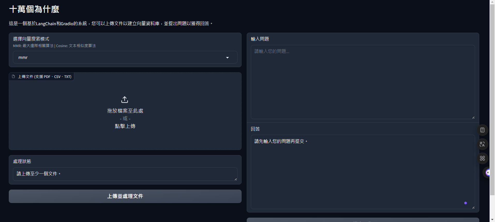

# LangChain RAG實作

## 1. 簡介

實作LangChain RAG，實現與大語言模型結合的聊天機器人

## 2. 目錄
- [LangChain RAG實作](#langchain-rag實作)
  - [1. 簡介](#1-簡介)
  - [2. 目錄](#2-目錄)
  - [3. 畫面最終呈現](#3-畫面最終呈現)
  - [4. 操作步驟](#4-操作步驟)
    - [方法一：python本地執行LangChain主程式](#方法一python本地執行langchain主程式)
      - [STEP1：請先將我的專案整包下載下來](#step1請先將我的專案整包下載下來)
      - [STEP2：建立並修改env檔](#step2建立並修改env檔)
      - [STEP3：安裝python套件](#step3安裝python套件)
      - [STEP4：執行python主程式](#step4執行python主程式)
    - [方法二：docker部署LangChain主程式](#方法二docker部署langchain主程式)
    - [API主程式(此步驟用於測試API時才要做)](#api主程式此步驟用於測試api時才要做)
      - [STEP1：API節點說明](#step1api節點說明)
      - [STEP2：執行api`建立Server`](#step2執行api建立server)
      - [STEP3：使用curl指令測試](#step3使用curl指令測試)

## 3. 畫面最終呈現


## 4. 操作步驟

### 方法一：python本地執行LangChain主程式  

#### STEP1：請先將我的專案整包下載下來

git指令

```bash
git clone https://github.com/Mark850409/20241224_LangChainWithGradioBot.git
```

沒有git，進入此連結，點擊code → DownloadZIP

```
https://github.com/Mark850409/20241224_LangChainWithGradioBot.git
```

#### STEP2：建立並修改env檔

請自行在專案下建立`.env`，按照以下範例進行調整

請先在地端建立語言模型，若沒有請以下擇一下載

LMstudio

https://lmstudio.ai/

Ollama

https://ollama.com/


 > [!note] 
 > 1. EMBEDDINGS_MODEL_NAME→可以使用HuggingFace、Ollama、LMstudio的模型，請自行更改模型名稱
 > 
 > 2. LLM_MODEL_NAME →可以使用HuggingFace、Ollama、LMStudio的模型，請自行更改模型名稱
 >
 > 3. API_KEY → 不重要，隨便填
 >
 > 4. BASE_URL→
 > 
 > ★ LMstudio：http://localhost:1234/v1/
 >
 > ★ Ollama：http://localhost:11434/v1/

範例：
```
EMBEDDINGS_MODEL_NAME = "intfloat/multilingual-e5-small"
LLM_MODEL_NAME = "llama-3.2-3b-instruct"
API_KEY = "lm-studio"
BASE_URL ="http://localhost:1234/v1/"
TEMPERATURE = "0.5"
VECTOR_DB_NAME = "faiss_1224_db"
```

#### STEP3：安裝python套件

```python
pip install -r requirements.txt
```

#### STEP4：執行python主程式

```python
python app.py
```

### 方法二：docker部署LangChain主程式  

 > [!note] 
 > Windows請先安裝Docker Desktop再執行此步驟

```docker
docker-compose up -d
```

### API主程式(此步驟用於測試API時才要做)

#### STEP1：API節點說明

 > [!note] 
 > /upload → 上傳檔案
 > 
 > /query → 使用者提問

#### STEP2：執行api`建立Server`

```python
python api.py
```

#### STEP3：使用curl指令測試
```bash
curl -X POST -H "Content-Type: application/json" -d "{\"question\":\"你好\",\"search_mode\":\"cosine\"}" http://localhost:5000/query
```
